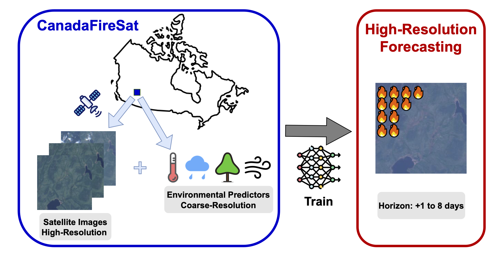
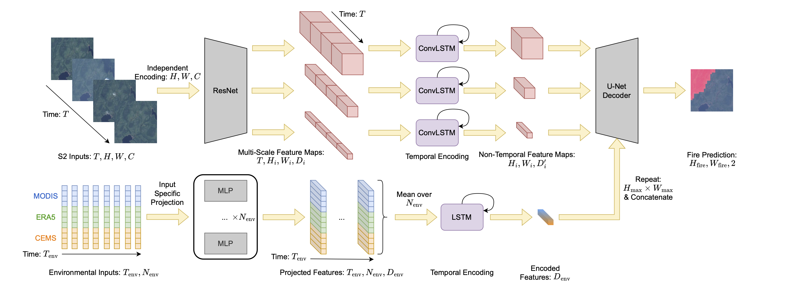
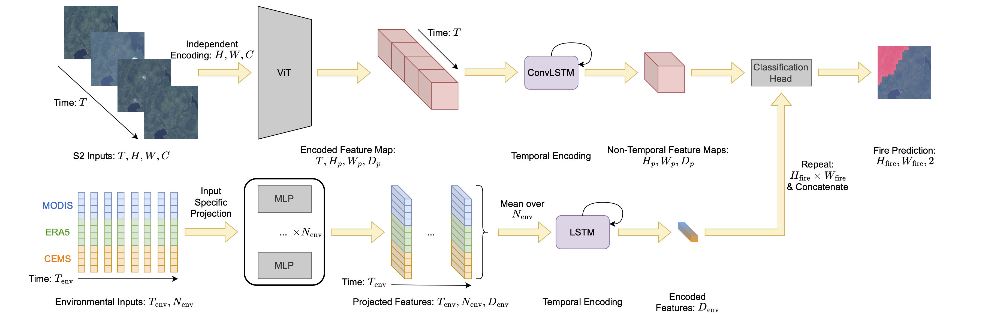
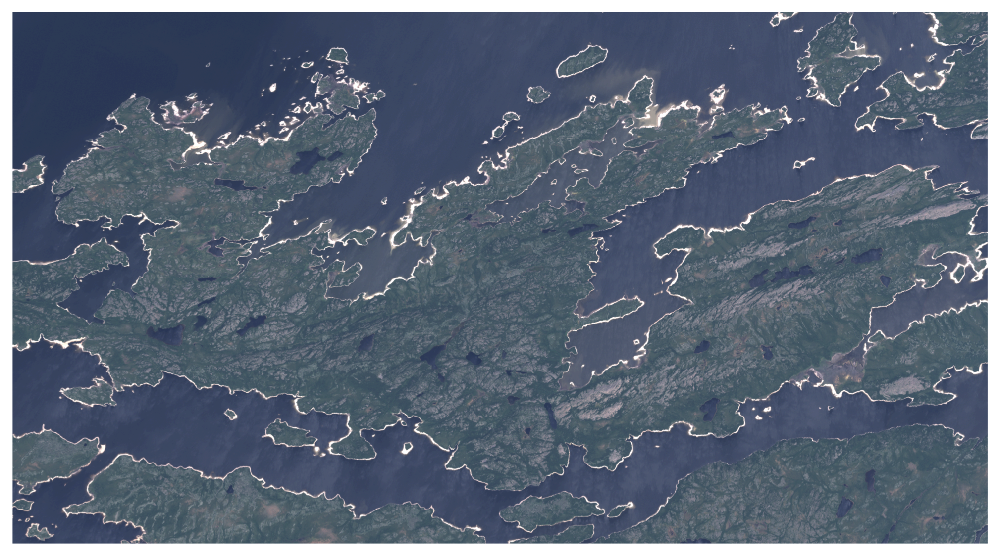
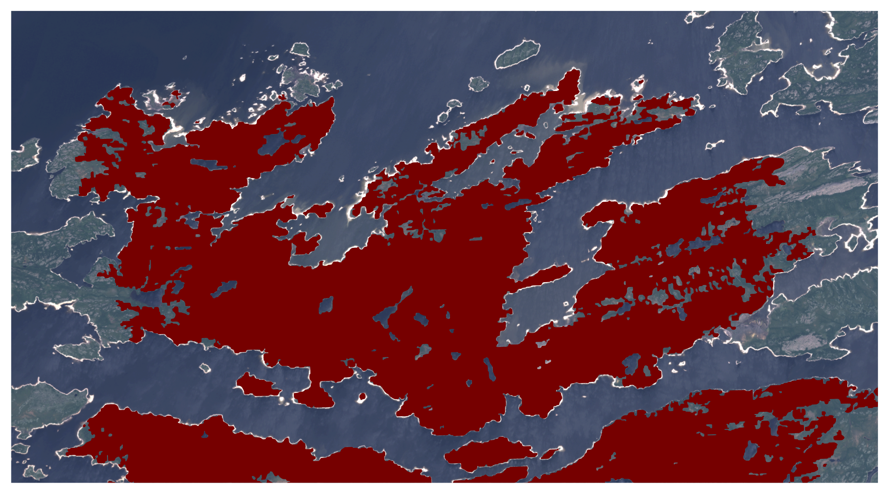
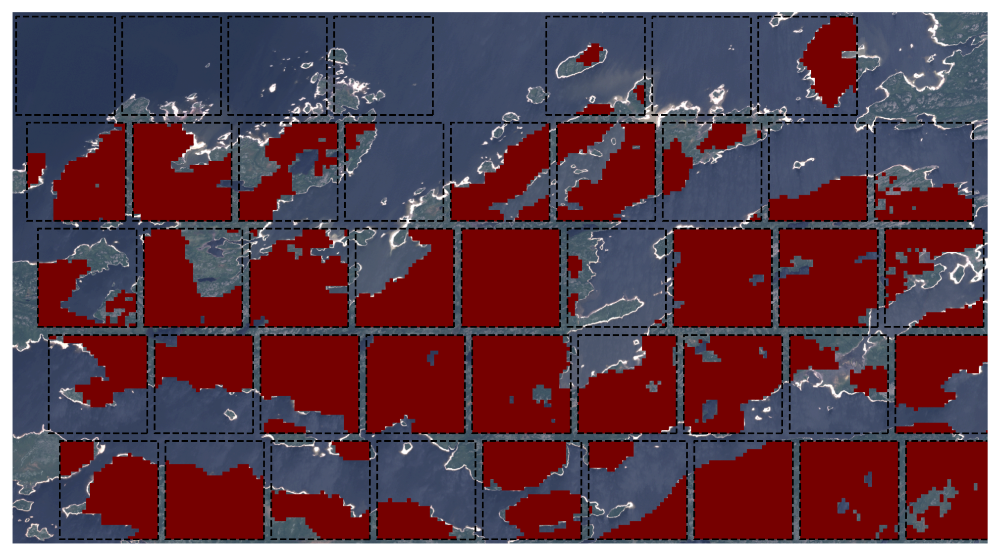

# 🔥🛰️ CanadaFireSat Model


[](https://huggingface.co/datasets/EPFL-ECEO/CanadaFireSat)

This repository contains the code for training models on the benchmark CanadaFireSate available. In this benchmark we investigate the potential of deep learning with multiple sensors for high-resolution wildfire forecasting.

- 💿 Dataset on [Hugging Face](https://huggingface.co/datasets/EPFL-ECEO/CanadaFireSat) <br>
- 📝 Paper on [ArXiv](TBC) <br>
- 📊 Data repository on [GitHub](https://github.com/eceo-epfl/CanadaFireSat-Data)
- 🤖 Model Weights on [Hugging Face](TBC)

**Summary Representation:**
<p align="center">
  
</p>

## Model Architectures

In this repository we train models following two different deep learning architectures CNN-based using ResNet encoders and transformer-based using ViT encoders.

Those models are trained across three data settings namely:

<table border="1" cellspacing="0" cellpadding="6" style="border-collapse: collapse; width: 100%; text-align: left;">
    <tr>
      <th>Setting</th>
      <th>Source</th>
      <th>Format</th>
      <th>Type</th>
    </tr>
  </thead>
  <tbody>
    <tr>
      <td rowspan="1" style="vertical-align: middle; text-align: center;">
        SITS ONLY
      </td>
      <td>Sentinel-2</td>
      <td>Spatial</td>
      <td>Multi-Spectral Images</td>
    </tr>
    <tr>
      <td rowspan="3" style="vertical-align: middle; text-align: center;">
        ENV ONLY
      </td>
      <td>MODIS</td>
      <td>Spatial</td>
      <td>Environmental Products</td>
    </tr>
    <tr>
      <td>ERA5-Land</td>
      <td>Spatial</td>
      <td>Climate Reanalysis</td>
    </tr>
    <tr>
      <td>CEMS</td>
      <td>Spatial</td>
      <td>Fire Indices</td>
    </tr>
    <tr>
      <td rowspan="4" style="vertical-align: middle; text-align: center;">
        Multi-Modal
      </td>
      <td>Sentinel-2</td>
      <td>Spatial</td>
      <td>Multi-Spectral Images</td>
    </tr>
    <tr>
      <td>MODIS</td>
      <td>Tabular</td>
      <td>Environmental Products</td>
    </tr>
    <tr>
      <td>ERA5-Land</td>
      <td>Tabular</td>
      <td>Climate Reanalysis</td>
    </tr>
    <tr>
      <td>CEMS</td>
      <td>Tabular</td>
      <td>Fire Indices</td>
    </tr>
  </tbody>
</table>

**CNN-Based Multi-Modal Architecture**

<p align="center">
  
</p>

**ViT-Based Multi-Modal Architecture**

<p align="center">
  
</p>

## 🛠️ Set-Up

- In order to log the model training you need to set-up a WandB profile or switch model loggers. You can specify your WandB informations in `global_config.yaml`.

- Then, you also need to install the python virtual environment:

```bash
python -m venv fire-env
source fire-env/bin/activate
pip install -r requirements/requirements.txt --extra-index-url https://download.pytorch.org/whl/cu117
```

- You can then download the data from [Hugging Face 🤗](https://huggingface.co/datasets/EPFL-ECEO/CanadaFireSat) leveraging `src.huggingface.download` | Config: `download.yaml`.

- Specify the data paths in the `global_config.yaml`.

## 🏋️ Model Training & Evaluation

- **Training**: Run the `src.train.segmentation_training` script with your selected training config: `ResNet_MULTI.yaml`, `ViT_MULTI.yaml`, ...

- **Evaluation**: Run the `src.eval.eval` script with your selected evaluation config: `eval.yaml`, `eval_tab.yaml`, ... . The model config described in the evaluation should matched the one of the its training config.

## 📷 Results

**📊 Performance Analysis**: In this table we describe the models' performances across data settings and architectures.

<table cellspacing="0" cellpadding="6" style="border-collapse: collapse; text-align: center; border: 2px solid white;">
    <tr>
      <th rowspan="2" style="border: 2px solid white;">Encoder</th>
      <th rowspan="2" style="border: 2px solid white;">Modality</th>
      <th rowspan="2" style="border: 2px solid white;">Params (M)</th>
      <th colspan="2" style="border: 2px solid white;">Val</th>
      <th colspan="2" style="border: 2px solid white;">Test</th>
      <th colspan="2" style="border: 2px solid white;">Test Hard</th>
      <th colspan="2" style="border: 2px solid white;">Avg</th>
    </tr>
    <tr>
      <th style="border: 2px solid white;">PRAUC</th><th style="border: 2px solid white;">F1</th>
      <th style="border: 2px solid white;">PRAUC</th><th style="border: 2px solid white;">F1</th>
      <th style="border: 2px solid white;">PRAUC</th><th style="border: 2px solid white;">F1</th>
      <th style="border: 2px solid white;">PRAUC</th><th style="border: 2px solid white;">F1</th>
    </tr>
  </thead>
  <tbody>
    <!-- ResNet-50 -->
    <tr>
      <td rowspan="3" style="border: 1px solid white;">ResNet-50</td>
      <td>SITS Only</td>
      <td>52.2</td>
      <td><u>45.9</u></td><td><u>49.4</u></td>
      <td><u>54.0</u></td><td><u>59.9</u></td>
      <td><u>26.2</u></td><td><u>36.7</u></td>
      <td><u>42.0</u></td><td><u>48.7</u></td>
    </tr>
    <tr>
      <td>ENV Only</td>
      <td>97.5</td>
      <td>41.6</td><td>46.7</td>
      <td>50.8</td><td>55.2</td>
      <td>24.5</td><td>33.1</td>
      <td>39.0</td><td>45.0</td>
    </tr>
    <tr style="border-bottom: 2px solid white;">
      <td>Multi-Modal</td>
      <td>52.2</td>
      <td><b>46.1</b></td><td><b>51.2</b></td>
      <td><b>57.0</b></td><td><b>60.3</b></td>
      <td><b>27.1</b></td><td><b>37.4</b></td>
      <td><b>43.4</b></td><td><b>49.6</b></td>
    </tr>
    <tr>
      <td rowspan="3" style="border: 1px solid white;">ViT-S</td>
      <td>SITS Only</td>
      <td>36.5</td>
      <td><b>45.2</b></td><td><b>50.6</b></td>
      <td><u>51.2</u></td><td>51.9</td>
      <td><b>25.7</b></td><td>33.8</td>
      <td><u>40.7</u></td><td>45.2</td>
    </tr>
    <tr>
      <td>ENV Only</td>
      <td>54.8</td>
      <td>34.8</td><td>45.7</td>
      <td>49.2</td><td><b>59.9</b></td>
      <td>21.2</td><td><u>35.1</u></td>
      <td>35.1</td><td><u>46.9</u></td>
    </tr>
    <tr style="border-bottom: 2px solid white;">
      <td>Multi-Modal</td>
      <td>37.7</td>
      <td><u>43.9</u></td><td><u>50.0</u></td>
      <td><b>56.2</b></td><td><u>59.2</u></td>
      <td><u>24.7</u></td><td><b>35.6</b></td>
      <td><b>41.6</b></td><td><b>48.3</b></td>
    </tr>
    <tr>
      <td colspan="1" style="border: 1px solid white;">Baseline (FWI)</td>
      <td>ENV Only</td>
      <td>-</td>
      <td>20.0</td><td>32.7</td>
      <td>43.1</td><td>50.3</td>
      <td>21.1</td><td>32.7</td>
      <td>28.1</td><td>38.6</td>
    </tr>
  </tbody>
</table>


**🗺️ Use Cases on large ROI:** We plot a large target area where a wildfire occurred in Québec in 2023, then the fire polygons corresponding to the wildfires then our model predictions across the region.

<p align="center">
  
</p>

<p align="center">
  <b>Figure 1:</b> Sentinel-2 tile from 2023/06/28 of size 14 km × 26 km before a large wildfire in Québec.
</p>

<p align="center">
  
</p>

<p align="center">
  <b>Figure 2:</b> Fire polygons for the large wildfire on 2023/07/05 over the same tile.
</p>

<p align="center">
  
</p>

<p align="center">
  <b>Figure 3:</b> Binary model predictions (in <span style="color:red">red</span>) over the 2.64 km × 2.64 km center-cropped positive samples outlined in black.
</p>

## 🖋️ Citation

```
TBC
```